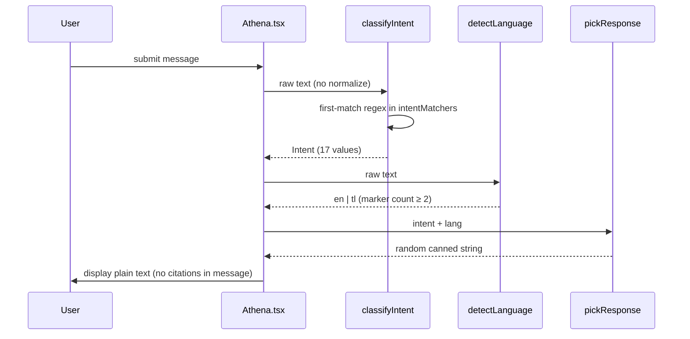
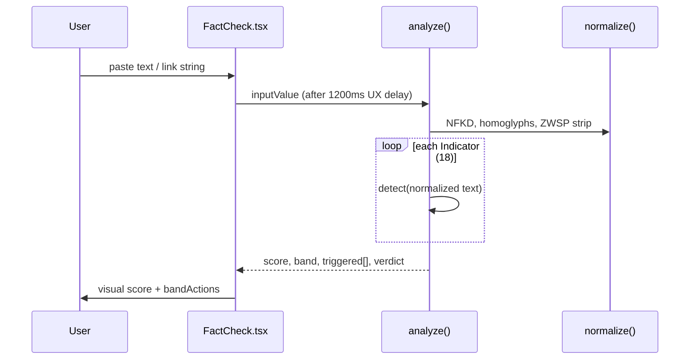

# Academic Systems Analysis & Improvement Plan

## Electronic Fraud Awareness System (EFAS)

**Document type:** Capstone / IS thesis systems-analysis chapter  
**System version assessed:** Client-side SPA (`magic-patterns-vite-template@0.0.1`, React 18, Vite 5)  
**Assessment date:** May 2026  
**Evaluator role:** Information Systems architecture, HCI, applied cybersecurity

---

## Executive Summary

EFAS is a statically deployed, browser-only cybersecurity awareness application oriented toward Filipino end users. It combines a curated knowledge base, a deterministic conversational agent (Athena), a heuristic message-verification module (FactCheck), an emergency contact directory, a minimal knowledge quiz, and a small set of scam alerts. The implementation demonstrates sound separation between presentation (`src/pages/`, `src/components/`) and domain logic (`src/data/`), but exhibits material gaps in observability, content governance, accessibility conformance, truthful UX claims, and longitudinal effectiveness measurement. This document proposes an evidence-informed, phased improvement roadmap aligned with recognized quality and cybersecurity frameworks, with implementation-grade specifications for three high-impact changes.

---

## 1. Theoretical & Evaluative Framework

### 1.1 ISO/IEC 25010:2011 — Product Quality Model

ISO/IEC 25010:2011 defines eight product-quality characteristics applicable to software-intensive systems (International Organization for Standardization, 2011). EFAS is evaluated as a **static web product** whose “services” are simulated in-process rather than delivered by a server.

| Characteristic | EFAS relevance | Initial assessment |
|----------------|----------------|-------------------|
| **Functional suitability** | Articles, alerts, FactCheck, Athena, emergency directory, quiz | Core flows implemented; FactCheck “image” tab and URL reputation are absent |
| **Performance efficiency** | Client-only heuristics; Framer Motion animations | Acceptable for static hosting; bundle size warnings at build (>500 kB JS chunk) |
| **Compatibility** | Modern browsers; `tel:` links on mobile | No explicit browser matrix; no service worker / offline mode |
| **Usability** | Multi-module navigation; Athena dialogue | Strong visual design; heuristic and copy inconsistencies undermine trust |
| **Reliability** | No runtime dependencies on network for analysis | Content and regex logic can silently decay; no health checks on external URLs |
| **Security** | Static attack surface; `dangerouslySetInnerHTML` on trusted bundle | Low server risk; supply-chain and XSS risk bounded by build integrity |
| **Maintainability** | TS modules for content | Content edits require developer rebuild; duplicated bilingual strings |
| **Portability** | Vite static `dist/` | High — deployable to any static host |

**Justification:** ISO/IEC 25010 provides a vendor-neutral vocabulary for NFR traceability from gap analysis through acceptance criteria.

### 1.2 NIST Cybersecurity Framework (CSF) 2.0

NIST CSF 2.0 organizes cybersecurity outcomes into **Govern, Identify, Protect, Detect, Respond, Recover** (National Institute of Standards and Technology, 2024). EFAS is an **awareness-and-response facilitation** tool, not a security control plane.

| CSF Function | EFAS mapping |
|--------------|--------------|
| **Govern** | Implicit via cited authorities (BSP, PNP-ACG, NPC); no formal governance workflow in software |
| **Identify** | Articles and scam alerts describe threat categories; no asset inventory for users |
| **Protect** | Educational content; Athena account-security intents; quiz |
| **Detect** | FactCheck heuristic rubric; user self-assessment of messages/links |
| **Respond** | Emergency directory; Athena `emergency` / `report_scam` intents; `bandActions` |
| **Recover** | Recovery steps in articles and Athena variants; no case tracking |

**Justification:** CSF 2.0 frames EFAS within national cybersecurity posture without misrepresenting the application as a SIEM or EDR substitute.

### 1.3 DeLone & McLean Information Systems Success Model

The updated IS success model posits relationships among **information quality**, **system quality**, **service quality**, **use**, **user satisfaction**, and **net benefits** (DeLone & McLean, 2003). For EFAS:

- **Information quality** depends on citation accuracy, regulatory alignment, and timeliness (`articles.ts`, `riskRubric.ts` source objects).
- **System quality** depends on reliability, responsiveness, and accessibility of the SPA.
- **Service quality** is approximated by Athena’s perceived helpfulness and FactCheck clarity—presently **without** measured service levels.
- **Use / satisfaction / net benefits** are **unmeasured** (no analytics, no surveys in-app).

**Justification:** The model directs evaluation beyond feature completeness toward demonstrable user outcomes—essential for capstone claims of “effectiveness.”

### 1.4 Nielsen’s Ten Usability Heuristics

Nielsen’s heuristics (Nielsen, 1994) are applied to navigation (`TopNav.tsx`), FactCheck results, and Athena’s chat surface:

| Heuristic | Observation |
|-----------|-------------|
| Visibility of system status | FactCheck shows score animation; Athena fakes typing delay without exposing intent or confidence |
| Match real world | Philippine hotlines, Taglish in Athena; English-only articles |
| User control | Quiz restart; no chat export or conversation reset affordance beyond refresh |
| Consistency | UI says “10 indicators” while rubric has 18 (`FactCheck.tsx:215` vs `riskRubric.ts`) |
| Error prevention | FactCheck warns on empty input; no confirm step before following high-risk advice |
| Recognition vs recall | Emergency categories filterable; Athena quick prompts aid discovery |
| Flexibility | Limited—no user preferences, font scaling beyond browser default |
| Aesthetic/minimalist | Polished Tailwind/Framer UI |
| Error recovery | Athena `fallback` intent; no structured “I was wrong” path |
| Help/documentation | About page; sidebar links in Athena not bound to responses |

### 1.5 WCAG 2.2 Level AA

Web Content Accessibility Guidelines 2.2 (W3C, 2023) are critical given the stated audience (seniors, low digital literacy). Current evidence:

- `index.html` declares `lang="en"` only.
- Minimal ARIA: `aria-label` on send and menu toggle; decorative avatar `aria-hidden`.
- No skip link, no `aria-live` for chat or FactCheck results, mobile menu lacks `aria-expanded` / focus trap.
- Risk bands rely partly on color (`bandStyles` in `FactCheck.tsx`).
- Motion: Framer Motion throughout without `prefers-reduced-motion` guards (assumption: not validated in audit).

**Justification:** Legal and ethical inclusion arguments in the Philippine context align with universal design, independent of explicit statutory web-accessibility mandates.

---

## 2. Current-State Architecture Assessment

### 2.1 Component Decomposition

```
┌─────────────────────────────────────────────────────────────────┐
│  Browser (static host: CDN / GitHub Pages / institutional web) │
└───────────────────────────────┬─────────────────────────────────┘
                                │
                    ┌───────────▼───────────┐
                    │   App.tsx (Router)    │
                    │   Layout + Outlet     │
                    └───────────┬───────────┘
          ┌─────────────────────┼─────────────────────┐
          │                     │                     │
    ┌─────▼─────┐        ┌──────▼──────┐       ┌──────▼──────┐
    │  Pages    │        │ Components  │       │  Data (TS)  │
    │  (9)      │        │ TopNav, etc.│       │ articles    │
    │           │        │             │       │ riskRubric  │
    │ Athena    │◄───────┤ AthenaAvatar│◄──────│ contacts    │
    │ FactCheck │        │ CitationCard│       │ quiz        │
    │ ...       │        │             │       │ scamAlerts  │
    └───────────┘        └─────────────┘       └─────────────┘
```

| Layer | Modules | Responsibility |
|-------|---------|----------------|
| **Routing** | `App.tsx` | Nine routes under `Layout` |
| **Presentation** | `src/pages/*.tsx` | Route-specific UI and orchestration |
| **Shared UI** | `src/components/*.tsx` | Navigation, citations, badges, branding |
| **Domain** | `src/data/*.ts` | Static content + `analyze()` + no exported Athena logic |

**Notable architectural choice:** Athena’s classifier (`classifyIntent`, `intentMatchers`, `responseVariants`) resides in `Athena.tsx` (~850 lines) rather than `src/data/`, coupling UI and NLP policy.

### 2.2 Data Flow — Athena



**Evidence:** `classifyIntent` at `Athena.tsx:132–137`; responses are not linked to `knowledgeSources` sidebar (`Athena.tsx:380–444`).

### 2.3 Data Flow — FactCheck



**Evidence:** `riskRubric.ts:47–58`, `466–505`; thresholds: High ≥61, Caution 31–60, Low 0–30.

### 2.4 Persistence Model

| State | Mechanism | Lifetime |
|-------|-----------|----------|
| Athena messages | `useState<Message[]>` | Session tab only |
| FactCheck result | `useState` | Session tab only |
| Quiz progress | Component state | Session tab only |
| User preferences | None | — |

**Implications:** No cross-session continuity, no audit trail, no aggregate fallback-rate measurement, no GDPR/RA 10173 data-processing register required for core flows—provided analytics remain absent.

### 2.5 Data Layer Coupling & Cohesion

| Module | Records | Cohesion | Coupling |
|--------|---------|----------|----------|
| `articles.ts` | 18 | High (single domain) | Imported only by article pages |
| `riskRubric.ts` | 18 indicators | High | FactCheck page only |
| `contacts.ts` | 22 | High | Emergency page; `lastVerified` present |
| `scamAlerts.ts` | 6 | High | Typed `ScamAlert` interface |
| `quiz.ts` | 4 | High | Undersized for psychometric validity |

Content is **compile-time bound**: updating a hotline requires TypeScript edit, test, and rebuild. Articles lack a shared `ContentMetadata` type; `ArticleDetail` displays `Last verified: {article.date}` conflating publication and verification (`ArticleDetail.tsx:80`).

### 2.6 Non-Functional Requirement Gaps

| NFR | Gap |
|-----|-----|
| **Observability** | No logging, metrics, or error reporting |
| **Auditability** | No versioned content changelog |
| **Content freshness** | Article dates to 2023; alerts static (6 items) |
| **Internationalization** | Athena bilingual strings only; `lang="en"` globally |
| **Resilience to TTP drift** | Regex lists frozen at build |
| **Evaluation methodology** | No labeled dataset for FactCheck; no Athena intent confusion matrix |

---

## 3. Gap Analysis

| Gap ID | Category | Description | Affected Quality Attribute(s) | Severity | Evidence in Codebase |
|--------|----------|-------------|------------------------------|----------|----------------------|
| G-01 | Content freshness & link integrity | No automated link checking; article `sourceUrl` and authority URLs may rot | Functional suitability, Information quality | High | `articles.ts` external URLs; no CI job |
| G-02 | Verification metadata | Articles use `date` as “Last verified”; no `lastVerified` ISO field | Information quality, Maintainability | Medium | `ArticleDetail.tsx:80`; contrast `contacts.ts` `lastVerified` |
| G-03 | UX truthfulness | Athena claims “verified citations and confidence scores” not rendered | Usability, Trust | High | `Athena.tsx:662`; messages are plain `text` |
| G-04 | FactCheck UI accuracy | Copy references “10 weighted indicators”; rubric has 18 | Usability, Maintainability | Medium | `FactCheck.tsx:215` vs `indicators.length` |
| G-05 | NLP / intent coverage | First-match regex; no normalization; `fallback` for long-tail | Functional suitability | High | `Athena.tsx:38–137`; no telemetry on fallback rate |
| G-06 | FactCheck ceiling | Summed weights cap at 100; multiple critical hits under-penalized vs severity logic; no URL reputation API | Functional suitability, Security | High | `riskRubric.ts:480–481`; link tab is text-only heuristic |
| G-07 | Telemetry & feedback | No privacy-respecting analytics; cannot measure DeLone “use” | Maintainability, Net benefits | High | No `localStorage`/analytics in `src/` |
| G-08 | Multilingual UI | UI strings English-only except Athena TL variants | Usability, Compatibility | Medium | `index.html lang="en"`; no i18next |
| G-09 | Accessibility | WCAG 2.2 AA gaps: live regions, focus trap, reduced motion | Usability, Compatibility | High | `TopNav.tsx` menu; `Athena.tsx` chat |
| G-10 | Content store maintainability | 18 articles embedded as HTML strings in TS | Maintainability | Medium | `articles.ts` ~800+ lines |
| G-11 | Static deployment security | `dangerouslySetInnerHTML` safe only if build trusted | Security | Low–Medium | `ArticleDetail.tsx:95–99` |
| G-12 | Threat intelligence | No Safe Browsing / PhishTank / local blocklist | Detect (CSF) | High | FactCheck link analysis = same text rubric |
| G-13 | Incomplete FactCheck modalities | Image tab stub; OCR not implemented | Functional suitability | Medium | `FactCheck.tsx:73–77`, `activeTab === 'image'` |
| G-14 | Quiz validity | 4 items insufficient for learning assessment | Information quality | Medium | `quiz.ts` |
| G-15 | Scam alert scale | 6 static alerts vs evolving landscape | Information quality | Medium | `scamAlerts.ts` |
| G-16 | Evaluation methodology | No benchmark dataset or IRB-ready study design | Net benefits | Critical (for academic claims) | No `docs/` evaluation protocol until this plan |
| G-17 | Dependency hygiene | Unused `@emotion/react`; ESLint 8 deprecated | Maintainability | Low | `package.json` |
| G-18 | Article link UX | URLs in prose not `<a>` tags—users cannot tap to verify | Usability | Medium | `articles.ts` plain-text domains in `<p>` |

---

## 4. Proposed Improvement Roadmap

### 4.1 Short Term (≤ 3 months) — Operational Hardening

**Rationale:** Low-cost changes that restore trust, enable measurement, and reduce reputational risk without architectural upheaval.

| Initiative | Actions |
|------------|---------|
| **Truth-in-UI** | Align FactCheck copy with 18 indicators; remove or implement Athena citation/confidence UI |
| **Citation governance** | Introduce `ContentMetadata` with `lastVerified`, `sourceUrl`, `contentVersion` on all content types |
| **Link integrity CI** | Scheduled `lychee` or `linkinator` on URLs in `src/data/`; fail build on Critical links |
| **Privacy-respecting analytics** | Plausible, Umami, or self-hosted Matomo with no cookies; custom events: `athena_fallback`, `factcheck_band` |
| **WCAG 2.2 AA pass** | Skip link, `aria-live="polite"` on chat/results, focus trap in mobile nav, `prefers-reduced-motion`, contrast audit |
| **Athena observability (client-only)** | Ephemeral session counter exported only via analytics beacon—no PII |

### 4.2 Medium Term (3–9 months) — Capability Expansion

**Rationale:** Address functional ceilings while preserving deterministic safety guarantees for high-risk advice.

| Initiative | Actions |
|------------|---------|
| **Hybrid Athena** | Retain regex for safety-critical intents (`emergency`, `otp`); add retrieval over chunked articles for `what_is` / `fallback` |
| **Externalized content** | MDX + frontmatter or headless CMS (Directus, Strapi) with build-time fetch; retain static deploy |
| **FactCheck URL layer** | Optional Google Safe Browsing Lookup API (serverless proxy to hide API key) or bundled PhishTank mirror |
| **i18n pipeline** | `i18next` with `en` / `fil` namespaces; professional review for Tagalog legal terms |
| **Expand quiz** | Item bank ≥20 questions; map to learning objectives per BSP/PNP advisories |

### 4.3 Long Term (9–24 months) — Systemic Maturity

**Rationale:** Transition from awareness artifact to **sustained national utility** with governance and evidence.

| Initiative | Actions |
|------------|---------|
| **Community scam corpus** | Consent-based submission, NPC-aligned privacy notice, moderator queue |
| **Authority feeds** | Signed RSS/Atom from PNP-ACG, NCERT; ingest at build or edge |
| **Longitudinal study** | Pre/post knowledge, task completion time, Athena fallback rate; IRB or institutional ethics review |
| **Replication package** | Open methodology, anonymized metrics, deployment guide for LGUs |

---

## 5. Technical Specification of Highest-Impact Improvements

### 5.1 Improvement A — Unified Content Metadata & Link-Integrity Pipeline

#### Problem statement

Content provenance is inconsistent: emergency contacts include `lastVerified`, articles conflate `date` with verification, and scam alerts lack verification timestamps. External URLs are not validated, undermining **information quality** (DeLone & McLean) and **functional suitability** (ISO 25010).

#### Proposed design

**Architecture sketch:**

```
content/
  articles/*.mdx          ← frontmatter + body
  schemas/content.ts      ← shared types
scripts/
  check-links.ts          ← CI: HTTP HEAD + retry
src/data/
  generated/              ← build step emits TS or JSON
```

**Data contract:**

```typescript
/** Shared across articles, alerts, contacts, rubric sources */
export type VerificationStatus =
  | 'officially_verified'
  | 'under_review'
  | 'community_reported';

export interface ContentMetadata {
  id: string;
  slug: string;
  title: string;
  publishedAt: string;       // ISO 8601
  lastVerifiedAt: string;    // ISO 8601 — distinct from publishedAt
  verificationStatus: VerificationStatus;
  sources: Array<{
    name: string;
    citation: string;
    url: string;
    regulatorCode?: 'PNP-ACG' | 'BSP' | 'DICT' | 'NPC' | 'SEC' | 'NTC' | 'NBI' | 'DMW' | 'NCERT';
  }>;
  contentVersion: number;    // increment on substantive edit
}

export interface Article extends ContentMetadata {
  summary: string;
  readTime: string;
  category: string;
  bodyHtml: string;          // sanitized at build
  authorities?: Array<{
    name: string;
    role: string;
    contact: string;
    url: string;
  }>;
}
```

**Build integration (Vite):**

```typescript
// vite.config.ts — conceptual
import { defineConfig } from 'vite';
import react from '@vitejs/plugin-react';
import { contentCodeGenPlugin } from './scripts/vite-plugin-content-codegen';

export default defineConfig({
  plugins: [react(), contentCodeGenPlugin()],
});
```

#### Alternatives considered

| Alternative | Trade-off |
|-------------|-----------|
| Continue inline TS strings | Zero migration cost; poorest maintainability |
| Runtime CMS fetch | Fresher content; introduces availability, XSS, and RA 10173 processing |
| MDX + build-time codegen | Best fit for static deploy; requires author training |

#### Risks, mitigations, rollback

| Risk | Mitigation | Rollback |
|------|------------|----------|
| Migration breaks article IDs | Map legacy `id` → `slug`; redirect table | Keep `articles.ts` on branch until parity |
| CI flakiness on gov sites | Allowlist retries; manual `link-check-skip` with justification | Disable failing URLs temporarily |

#### Acceptance criteria (testable predicates)

1. ∀ content records: `lastVerifiedAt` parses as valid ISO 8601 and `lastVerifiedAt ≥ publishedAt`.
2. `ArticleDetail` displays `lastVerifiedAt`, not `publishedAt`, under “Last verified.”
3. CI fails if any `sources[].url` returns consecutive failures (configurable: 3xx/4xx/5xx).
4. `npm run content:validate` exits 0 on main branch.

---

### 5.2 Improvement B — Hybrid Athena Classifier with Constrained Retrieval

#### Problem statement

Regex-first classification degrades on paraphrase and long-tail queries, increasing **fallback** responses without improving user satisfaction. Expanding regex alone increases collision risk (e.g., `help` matching `capabilities` before `emergency`). Quality attributes: **functional suitability**, **usability**.

#### Proposed design

**Policy:** Safety-critical intents remain **regex-only, highest priority**. Educational intents use **retrieval-augmented generation (RAG) constrained** to curated corpus—no open-web LLM for actionable legal/financial advice.

```
User input
    │
    ▼
┌───────────────────┐
│ SafetyRegexGate   │── match emergency|otp|report_scam ──► CannedResponse + Citation[]
└─────────┬─────────┘
          │ no match
          ▼
┌───────────────────┐
│ IntentRegex       │── known intent ──► CannedResponse + optional RAG enrich
└─────────┬─────────┘
          │ fallback
          ▼
┌───────────────────┐
│ LocalRetriever    │── top-k chunks from articles (MiniLM / BM25 in WASM)
└─────────┬─────────┘
          ▼
┌───────────────────┐
│ ResponseComposer  │── template fill + mandatory citation footer
└───────────────────┘
```

**Interfaces:**

```typescript
export type Intent =
  | 'emergency' | 'otp' | 'report_scam' /* ... existing 17 */;

export interface ClassifierResult {
  intent: Intent;
  confidence: 'high' | 'medium' | 'low';  // high = regex safety hit
  method: 'safety_regex' | 'intent_regex' | 'retrieval' | 'fallback';
  citations: Array<{ title: string; url: string; sourceId: string }>;
}

export interface AthenaClassifier {
  classify(input: string): ClassifierResult;
}

export interface KnowledgeRetriever {
  search(query: string, k: number): Array<{
    chunkId: string;
    articleId: string;
    text: string;
    score: number;
  }>;
}
```

**Response envelope (fixes G-03):**

```typescript
export interface AthenaMessage {
  role: 'user' | 'athena';
  text: string;
  meta?: {
    intent: Intent;
    confidence: 'high' | 'medium' | 'low';
    method: ClassifierResult['method'];
    citations: ClassifierResult['citations'];
  };
}
```

Refactor `intentMatchers` from `Athena.tsx` into `src/services/athena/classifier.ts` and `src/services/athena/safetyIntents.ts`.

#### Alternatives considered

| Alternative | Trade-off |
|-------------|-----------|
| Pure regex expansion | Predictable but brittle; maintenance burden |
| Cloud LLM (GPT-class) | Better fluency; hallucination risk on legal steps; RA 10173 data transfer |
| Hybrid regex + local RAG | Best safety/coverage balance; WASM bundle size cost |

#### Risks, mitigations, rollback

| Risk | Mitigation | Rollback |
|------|------------|----------|
| Retrieval returns irrelevant chunk | Minimum score threshold; show “I’m not sure” + emergency link | Feature flag `VITE_ATHENA_RAG=0` |
| WASM latency on low-end phones | Precompute chunk index at build; limit k=3 | Regex-only path |

#### Acceptance criteria

1. On labeled set of ≥100 queries, `emergency` intent recall ≥ 0.95 (regex gate).
2. Fallback rate on held-out FAQ set decreases ≥ 20% relative to baseline (assumption: to be measured).
3. Every `athena` message with `method !== 'intent_regex'` includes ≥1 citation object rendered in UI.
4. UI removes “confidence scores” claim unless `meta.confidence` is displayed.

---

### 5.3 Improvement C — FactCheck URL Reputation Layer + Rubric Scoring Revision

#### Problem statement

The link tab applies the same text heuristics as SMS bodies (`analyze(inputValue)`). Homoglyph-normalized URLs may still be benign or malicious independent of diction. Summed weights (`min(Σ weight, 100)`) treat ten low-severity hits equivalently to two critical hits—weak **Detect** function per NIST CSF.

#### Proposed design

**Two-phase analysis:**

```typescript
export type UrlReputationSource =
  | 'google_safe_browsing'
  | 'phishtank'
  | 'local_blocklist';

export interface UrlCheckResult {
  url: string;
  normalizedUrl: string;
  reputation: 'malicious' | 'suspicious' | 'unknown' | 'safe';
  source: UrlReputationSource;
  detail?: string;
}

export interface Indicator {
  id: string;
  label: string;
  description: string;
  weight: number;
  severity: 'low' | 'medium' | 'high' | 'critical';
  source: { name: string; citation: string; url: string };
  detect: (text: string) => { triggered: boolean; evidence?: string };
  /** NEW: cap contribution when many low-severity fire together */
  maxContribution?: number;
}

export interface AnalysisResult {
  score: number;
  band: RiskBand;
  bandLabel: string;
  verdict: string;
  triggered: Array<Indicator & { evidence?: string; appliedWeight: number }>;
  notTriggered: Indicator[];
  urlCheck?: UrlCheckResult;
  scoringModel: 'weighted_sum_v2';
}
```

**Scoring revision (v2):**

```typescript
function appliedWeight(ind: Indicator, triggered: boolean): number {
  if (!triggered) return 0;
  const base = ind.weight;
  if (ind.severity === 'critical') return base;
  return Math.min(base, ind.maxContribution ?? base);
}

// URL override: malicious reputation → floor score at 61 (high band)
```

**Serverless proxy (API key protection):**

```
Browser ──POST /api/check-url──► Edge function ──► Google Safe Browsing v4
         (no API key in bundle)
```

For strict static-only deploy: ship **weekly-updated** `public/blocklist.json` (PhishTank-derived, license-compliant) and document staleness in UI.

#### Alternatives considered

| Alternative | Trade-off |
|-------------|-----------|
| Client-side API key | Simple; unacceptable secret exposure |
| Heuristic-only | No infra; misses pure URL threats |
| Serverless proxy + blocklist fallback | Resilient; requires hosting budget |

#### Risks, mitigations, rollback

| Risk | Mitigation | Rollback |
|------|------------|----------|
| API quota / cost | Cache results 24h by URL hash; rate limit per IP | Blocklist-only mode |
| False positive blocks legitimate PH gov domains | Allowlist `*.gov.ph`, `*.edu.ph` | Manual override list |
| GSB ToS restrictions | Read Google API ToS; institutional account | PhishTank mirror only |

#### Acceptance criteria

1. Known phishing URL from test set → `band === 'high'` OR `urlCheck.reputation === 'malicious'`.
2. Benign `https://www.bsp.gov.ph` → not flagged malicious.
3. Labeled corpus (n ≥ 200): report precision, recall, F1 per band with 95% CI (methodology §6).
4. `FactCheck.tsx` copy matches `indicators.length` dynamically.

---

## 6. Evaluation Methodology for the Improved System

### 6.1 Quantitative Metrics

| Metric | Definition | Instrument |
|--------|------------|------------|
| **Athena fallback rate** | `fallback` intents / total turns | Analytics event `athena_intent` |
| **Athena safety recall** | True emergencies classified as `emergency` | Labeled query set |
| **FactCheck precision/recall** | vs expert-labeled PH scam corpus | Confusion matrix on `band` |
| **Mean time to complete (MTTC)** | Start → copy hotline for “scammed” flow | Moderated usability tasks |
| **WCAG conformance** | Automated + manual | axe-core CI + manual WCAG 2.2 AA checklist |
| **Lighthouse scores** | Performance, Accessibility, Best Practices | CI on production build |
| **Citation link-integrity ratio** | Valid URLs / total URLs | Weekly CI report |
| **Quiz learning gain** | Post − pre score | Paired t-test or Wilcoxon (n ≥ 30) |

**FactCheck benchmark design (minimum):**

- Construct or adapt **200+ labeled samples**: SMS smishing, GCash impersonation, job scams, benign transactional messages (assumption: labels by two independent raters with Cohen’s κ reported).

### 6.2 Qualitative Methods

| Method | Segment | Purpose |
|--------|---------|---------|
| Think-aloud (n≈5–8 per segment) | Seniors (60+), OFW families, Gen-Z students | Nielsen heuristic violations |
| Expert heuristic review | Licensed infosec / PNP-ACG liaison | Content accuracy |
| Cognitive walkthrough | Low digital literacy | Emergency flow under stress |

Claims about segment behavior (e.g., “seniors prefer voice”) remain **assumptions** until observed.

### 6.3 Sampling & Ethics

- **Inclusion:** Filipino residents or target LGU population; Tagalog/English bilingual option disclosed.
- **Exclusion:** Minors without guardian consent.
- **Consent:** Written or recorded digital consent; right to withdraw.
- **Data minimization:** No chat content retention without explicit opt-in; analytics aggregate-only.
- **Ethics review:** Institutional Research Board or equivalent before longitudinal study (G-16).
- **RA 10173:** Privacy notice if any PII collected; Data Protection Officer designation if community corpus launched.

---

## 7. Threats to Validity & Limitations

### 7.1 External Validity

Usability samples drawn from urban, university-adjacent populations may not generalize to rural Mindanao or BARMM connectivity contexts. Replication across at least two geographic strata is recommended.

### 7.2 Concept Drift

Scam tactics evolve faster than release cycles. Regex and static indicators exhibit **concept drift**; without telemetry, degradation is invisible. Mitigation: quarterly regex review driven by fallback-query logs (post G-07).

### 7.3 Third-Party Dependencies

Google Safe Browsing and PhishTank impose rate limits, terms of use, and geographic/API availability constraints. Edge functions introduce operational dependency not present in the current static architecture.

### 7.4 Legal & Regulatory

- **Data Privacy Act of 2012 (RA 10173):** User-submitted scam reports constitute personal data if they include phone numbers or screenshots with identifiers. Requires lawful basis, retention schedule, and security measures.
- **Financial Consumer Protection Act (RA 11765):** Educational content must not impersonate BSP supervision or provide individualized financial advice.
- **ePrivacy / marketing:** Analytics cookies (if any non-essential) require consent under NPC advisories—prefer cookieless analytics.

### 7.5 Construct Validity

FactCheck score is a **heuristic index**, not a probabilistic fraud likelihood. Presenting it as definitive “detection” overstates capability—UI should frame as “risk signals” (honest deterministic framing per project philosophy).

---

## 8. Conclusion & Contribution

EFAS occupies a valuable niche: a **locally contextualized, statically deployable** cybersecurity awareness surface that cites Philippine regulatory authorities and embeds operational hotlines. Its current architecture is appropriate for low-infrastructure deployment but insufficient for claims of measured effectiveness, inclusive access, or sustained threat relevance.

The proposed roadmap advances EFAS toward an **evidence-informed platform** by:

1. Governing content with verifiable metadata and CI link integrity.
2. Preserving safety-critical determinism while improving coverage through constrained retrieval.
3. Complementing linguistic heuristics with URL reputation signals and honest scoring semantics.
4. Embedding evaluation instruments required for academic defense and authority partnership.

The contribution is **replicable**: open schemas, labeled benchmarks, privacy-respecting metrics, and static-first deployment lower barriers for LGUs and academic peers. Partnership with PNP-ACG or DICT NCERT—via signed advisory feeds rather than unverified crowdsourcing alone—would elevate information quality from editorial to **operational intelligence** without contradicting EFAS’s core constraint of user privacy.

---

## References

DeLone, W. H., & McLean, E. R. (2003). The DeLone and McLean model of information systems success: A ten-year update. *Journal of Management Information Systems*, *19*(4), 9–30.

International Organization for Standardization. (2011). *ISO/IEC 25010:2011 Systems and software engineering — Systems and software Quality Requirements and Evaluation (SQuaRE) — System and software quality models*. ISO.

National Institute of Standards and Technology. (2024). *The NIST Cybersecurity Framework (CSF) 2.0* (NIST CSWP 29). U.S. Department of Commerce. https://www.nist.gov/cyberframework

Nielsen, J. (1994). Enhancing the explanatory power of usability heuristics. *Proceedings of the SIGCHI Conference on Human Factors in Computing Systems*, 152–158.

Republic Act No. 10173. (2012). *Data Privacy Act of 2012* (Philippines).

Republic Act No. 11765. (2022). *Financial Products and Services Consumer Protection Act* (Philippines).

W3C Web Accessibility Initiative. (2023). *Web Content Accessibility Guidelines (WCAG) 2.2*. W3C Recommendation. https://www.w3.org/TR/WCAG22/

---

## Appendix A — Codebase Inventory (Assessment Snapshot)

| Asset | Count | Primary file |
|-------|-------|--------------|
| Routes / pages | 9 | `src/App.tsx` |
| Articles | 18 | `src/data/articles.ts` |
| FactCheck indicators | 18 | `src/data/riskRubric.ts` |
| Emergency contacts | 22 | `src/data/contacts.ts` |
| Scam alerts | 6 | `src/data/scamAlerts.ts` |
| Quiz questions | 4 | `src/data/quiz.ts` |
| Athena intents | 17 | `src/pages/Athena.tsx` |

## Appendix B — Traceability Matrix (Gap → Horizon)

| Gap ID | Short | Medium | Long |
|--------|-------|--------|------|
| G-01, G-02 | ✓ | ✓ | |
| G-03, G-05 | ✓ | ✓ | |
| G-06, G-12 | | ✓ | ✓ |
| G-07 | ✓ | ✓ | ✓ |
| G-09 | ✓ | | |
| G-16 | ✓ | ✓ | ✓ |

---

*This document is integrated with the EFAS repository at `docs/ACADEMIC_SYSTEMS_ANALYSIS_AND_IMPROVEMENT_PLAN.md` and should be versioned alongside application releases.*

---

## Appendix C — Phase 1 Implementation Log (May 2026)

The following short-term items from §4.1 were implemented in code:

| Item | Implementation |
|------|----------------|
| G-03 UX truthfulness | `AthenaMessageBubble` renders confidence label + per-intent citations; header copy corrected |
| G-04 FactCheck copy | Dynamic `{indicators.length}` (18) in methodology card |
| G-02 Verification metadata | `Article` type with optional `lastVerifiedAt`; `ArticleDetail` separates published vs verified dates |
| G-05 Classifier maintainability | `src/services/athena/classifier.ts`, `citations.ts`, `classifyWithMeta()` |
| G-09 Accessibility (partial) | Skip link, `aria-live` on chat/results, mobile menu `aria-expanded`, `prefers-reduced-motion` |
| G-01 Link integrity (tooling) | `npm run content:check-links` / `content:check-links:ci` via `scripts/check-links.mjs` |

Remaining short-term items: privacy-respecting analytics, full WCAG audit, MDX content externalization (§5.1).
