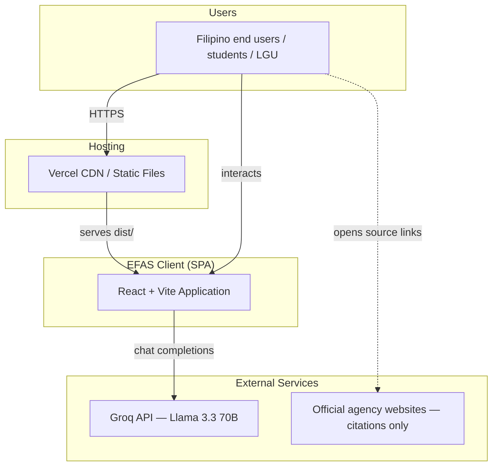
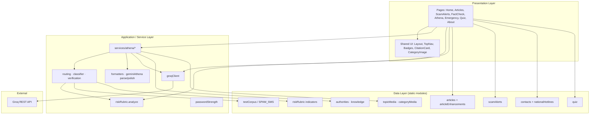
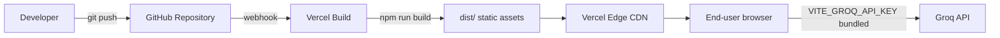
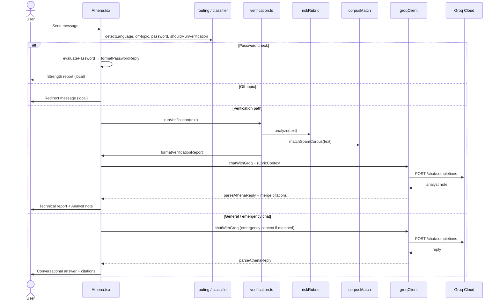
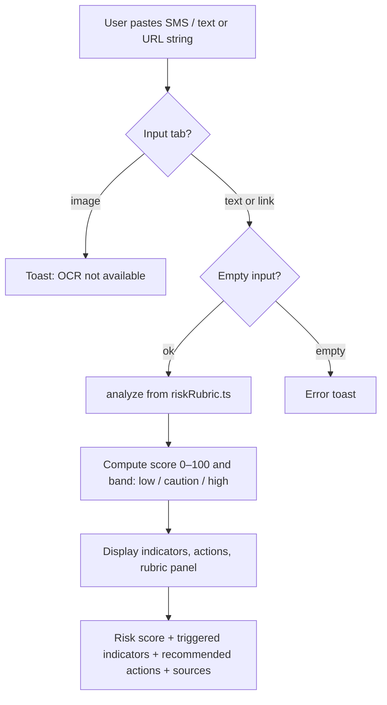
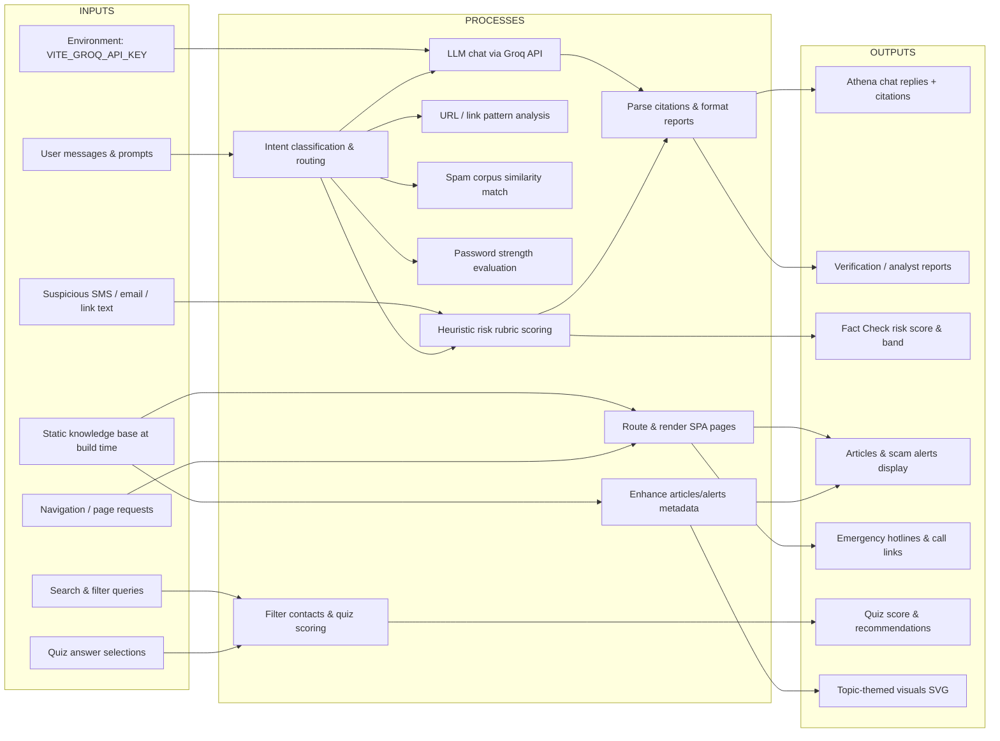
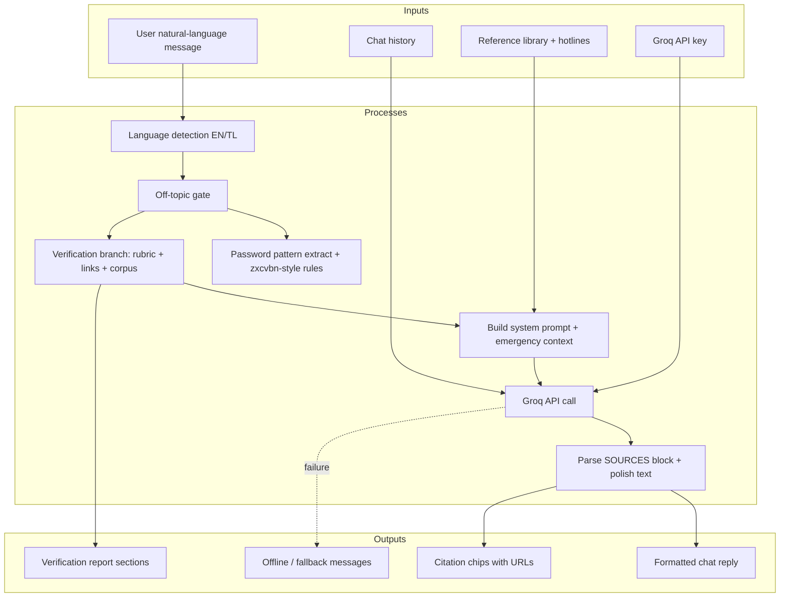
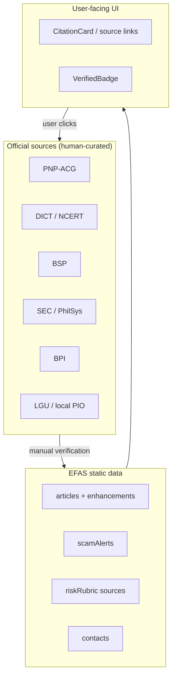

# EFAS — System Architecture & IPO Diagrams

**Electronic Fraud Awareness System (EFAS)**  
**Version:** Client SPA (React 18 + Vite 5)  
**Deployment:** Static hosting (e.g. Vercel) + Groq Cloud API

This document describes the **system architecture** and **Input–Process–Output (IPO)** models for capstone documentation, defense slides, and technical reports.

---

## 1. System Context (High-Level)

EFAS is a **browser-based** cybersecurity awareness application. Most processing runs **in the user’s browser**. Athena conversational replies optionally call the **Groq LLM API** over HTTPS. Content (articles, alerts, contacts, rubric, spam corpus) is **bundled at build time**—there is no EFAS-owned backend database.

---

## 2. Layered System Architecture

### 2.1 Module map (repository)

| Layer | Path | Responsibility |
|--------|------|----------------|
| Presentation | `src/pages/*` | Route-level screens and user flows |
| Presentation | `src/components/*` | Reusable UI (nav, citations, images) |
| Application | `src/services/athena/*` | Athena routing, verification, formatting |
| Application | `src/data/groqClient.ts` | Groq HTTP client + system prompt |
| Data | `src/data/*.ts` | Curated content, rubric, corpus, quiz |
| Data | `src/docs/SPAM_SMS.csv` | Spam SMS reference corpus (source data) |
| Cross-cutting | `src/lib/analytics.ts` | Client-side event logging (dev/debug) |

---

## 3. Deployment Architecture (Vercel)

**Note:** `VITE_GROQ_API_KEY` is injected at **build time** into the client bundle. For production hardening, a future version could proxy Groq calls through a serverless function.

---

## 4. Athena — Processing Flow (Sequence)

---

## 5. Fact Check — Processing Flow

---

## 6. System-Level IPO Diagram

### 6.1 IPO block diagram

### 6.2 System-level IPO table

| **Input** | **Process** | **Output** |
|-----------|-------------|------------|
| User navigates to `/`, `/articles`, `/scam-alerts`, etc. | React Router loads page; static data modules imported | Rendered UI with verified content and images |
| User pastes suspicious text in **Fact Check** | `analyze()` applies weighted indicators from `riskRubric.ts` | Risk score (0–100), band (low/caution/high), triggered rules, action checklist |
| User sends message in **Athena** | Classify intent → optional `runVerification()` → optional Groq completion | Chat bubble: education, verification report, or emergency steps with agency links |
| User completes **Quiz** | Compare selected index to `correctAnswer`; aggregate score | Percentage score, tier message, links to articles / Athena / Emergency |
| User searches **Emergency** directory | Filter `contacts` by category + search string | Filtered cards with `tel:` links, citations, copy hotline |
| Curated JSON/TS content at build | `enhanceArticles()`, `getAlertImageUri()`, topic SVG generation | Articles with specific `sourceUrl`, alert cards, themed thumbnails |
| Groq API key (env) | HTTPS POST to Groq chat completions | Natural-language analyst note (when online) |

---

## 7. Submodule IPO Diagrams

### 7.1 Athena (conversational agent)

| Input | Process | Output |
|-------|---------|--------|
| User message | `shouldRunVerification()` | Branch: verify vs chat vs password |
| Suspicious text | `runVerification()` | Rubric + link flags + corpus hits |
| Message + report context | `chatWithGroq()` | Analyst note |
| Any | `formatVerificationReport()` / `polishAthenaText()` | User-readable plain text |

---

### 7.2 Fact Check (message analyzer)

| Input | Process | Output |
|-------|---------|--------|
| SMS/email body text | Match 18+ heuristic indicators with weights | List of triggered / not triggered indicators |
| Same text | Sum weights, cap score, assign band | Score 0–100, low/caution/high |
| Same text | Map band to `bandActions` | Recommended user actions |
| User opens rubric panel | Load `indicators` + methodology copy | Full rubric reference UI |

---

### 7.3 Content modules (Articles & Scam Alerts)

| Input | Process | Output |
|-------|---------|--------|
| Raw article records (`articles.ts`) | `enhanceArticle()`: topic image, `sourceUrl`, `references[]` | Enriched article objects for UI |
| Raw alerts (`scamAlerts.ts`) | `getAlertImageUri()` per alert id | Alert cards with themed SVG + official `sourceUrl` |
| User opens article detail | `dangerouslySetInnerHTML` on trusted HTML body | Rendered guide + authorities + source links |

---

### 7.4 Emergency directory

| Input | Process | Output |
|-------|---------|--------|
| `contacts.ts`, `nationalHotlines.ts` | Category filter + text search | Filtered contact grid |
| User taps Call / Copy | `tel:` URI / clipboard API | Phone dialer or copied number |

---

### 7.5 Quiz

| Input | Process | Output |
|-------|---------|--------|
| User selects option per question | Compare to `correctAnswer`, increment score | Per-question correct/incorrect feedback |
| All questions answered | `(score / total) * 100`, tier rules | Final % + recommendation + deep links |

---

## 8. Data Flow — Knowledge & Trust

---

## 9. Technology Stack Summary

| Component | Technology |
|-----------|------------|
| Frontend framework | React 18 |
| Build tool | Vite 5 |
| Language | TypeScript |
| Styling | Tailwind CSS |
| Routing | React Router 6 |
| Animation | Framer Motion |
| LLM provider | Groq (`llama-3.3-70b-versatile`) |
| Hosting | Vercel (static SPA + `vercel.json` rewrites) |
| Icons | Lucide React |

---

## 10. Figure captions (for thesis)

**Figure 1.** System context diagram of EFAS showing the end user, static web client, Vercel hosting, and Groq API.

**Figure 2.** Layered architecture of EFAS (presentation, application services, static data, external API).

**Figure 3.** System-level IPO model illustrating inputs (user content, navigation, environment variables, curated data), processes (routing, heuristics, verification, LLM), and outputs (reports, educational content, emergency contacts).

**Figure 4.** Athena sequence diagram for verification and conversational branches.

**Figure 5.** Submodule IPO for the Fact Check heuristic engine.

---

*Generated from the EFAS codebase structure as of May 2026. Update this document when adding a backend API, database, or changing the LLM provider.*
